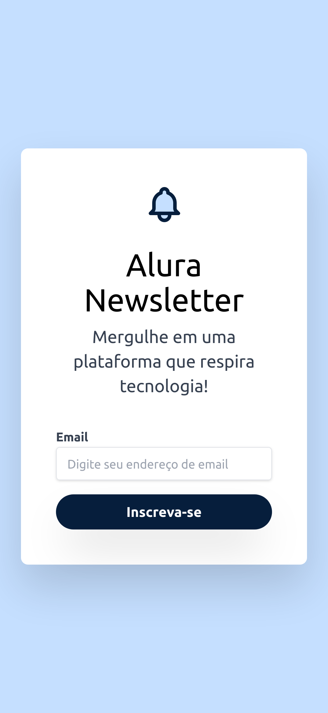

# aluranewsletter

  

    
  

  

   
  

#

Curso do framework css tailwind da plataforma Alura.

<ul>
  <li>Dimensionamento e estilização</li>
  <li>Layout responsivo</li>
  <li>Parent state</li>
  <li>Animation</li>
</ul>
